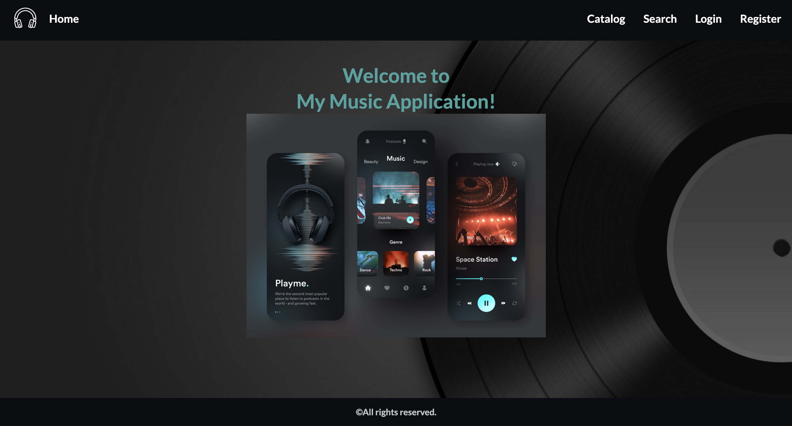
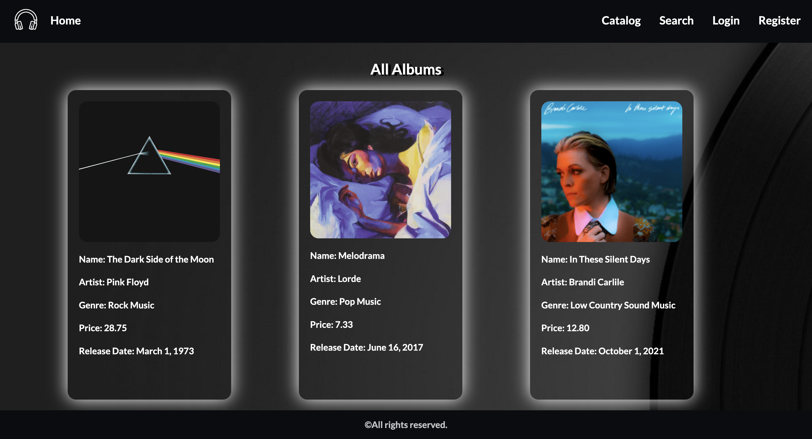
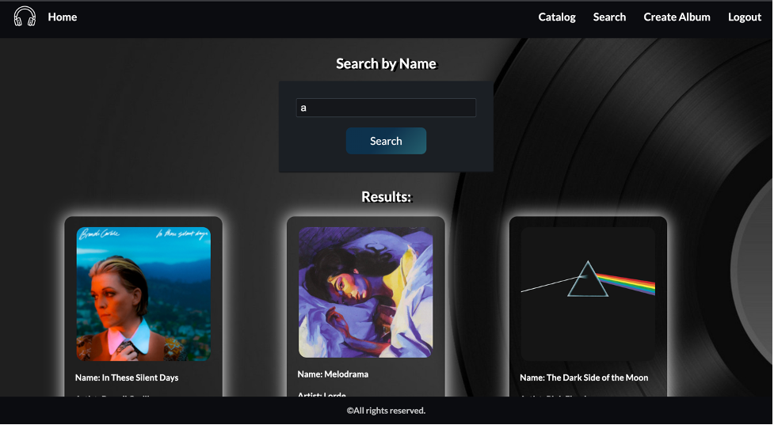
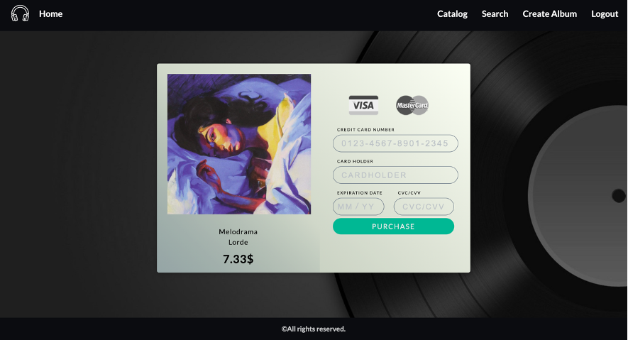
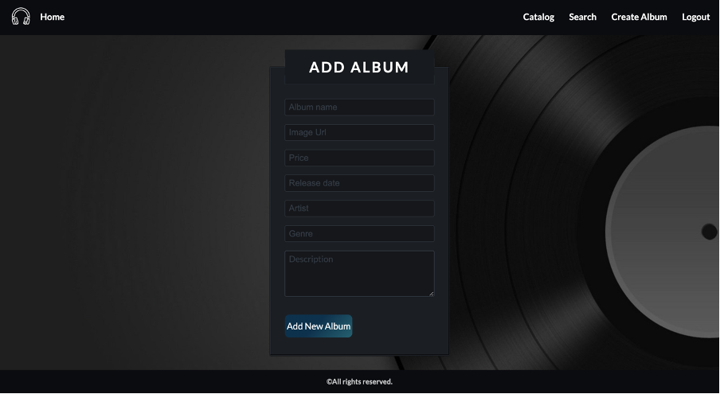

# Music-App

## Description

It is a web-based application that works like an online music catalog that allows users to buy albums. It has keyword search option, admin panel to create albums and user registration. The main pages include Home, Catalog, Search, Create Album, Register, Login and Buy Album. Users can browse and buy albums, while administrators manage content.

## Screenshots

**Home Page:**

</img>

**Catalog Page:**

</img>

**Search Functionality:**

</img>

**Payment Form:**

</img>

**Add Album Form:**

</img>

## Installation and Setup

1. Clone the repository to your local machine.
2. Navigate to the project folder and run `npm install` to install the required dependencies.
3. Start the node server with `npm start`.
4. Start the development server with `npm run dev`.
